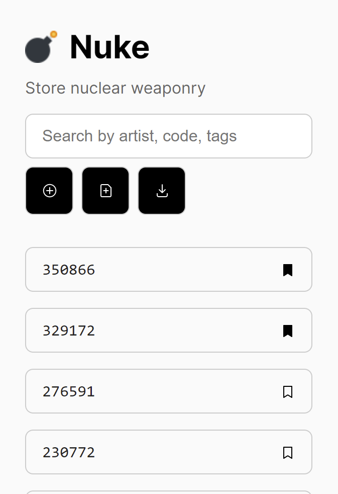
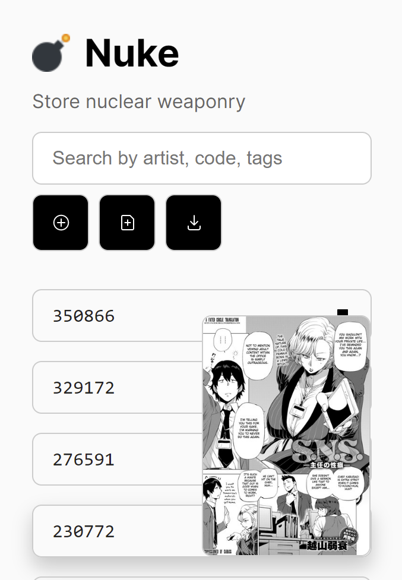
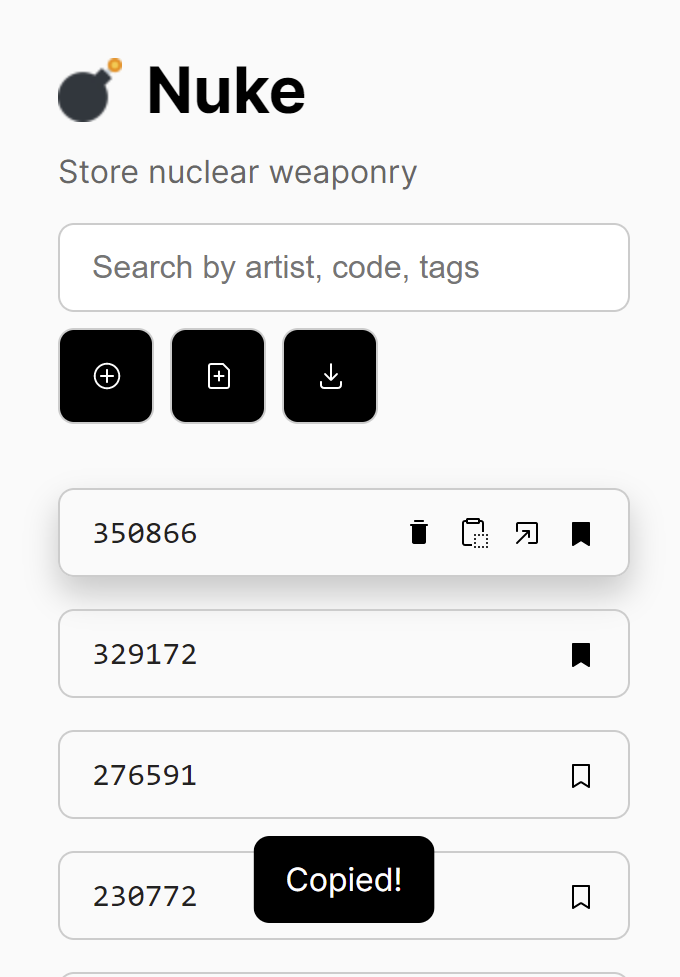
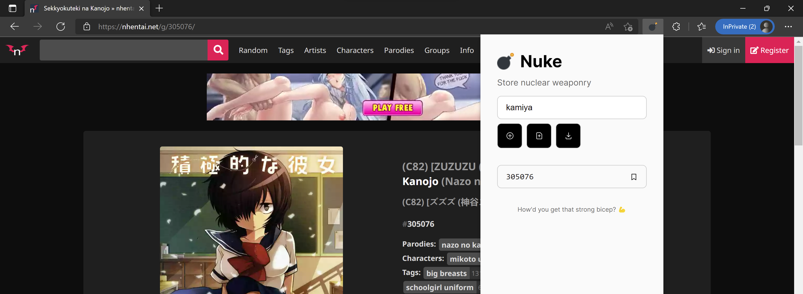

# Nuke

Store nuclear weaponry

## Screenshots

## Usage

It should be fairly intuitive to nuke stuff. Visit any doujin (any link containing `/g/<code>` if you know what I mean) and click the circular "Import doujin" button. You can re-order codes, search for added doujin, bookmark stuff, and more. If you would rather save the doujin locally on a file, you can press the "Export" button. Hover over any "code" to see the doujin's cover image. If you accidentally delete a doujin, never fear! Simply press Ctrl + Z to undo (or just import from a previous save). If you only want to see bookmarked doujin, just type "liked" into the input field.

Note on imports: imports do not overwrite, they will retain the original list and add to it. They may not retain order though.

## Installation

As this is not an "official" extension that can be released on the Chrome Web Store, you'll have to enable it manually by loading an unpacked extension.

1. Visit `chrome://extensions` (or `edge://extensions`, depending on the browser the first part will change)
2. Toggle "developer mode" to allow you to load unpacked extensions
3. Download this Github repository and extract it to a folder
4. Click "Load unpacked" and select the extracted folder

Now obviously I'd be a bit skeptical at downloading a literal hentai manager but that's why it's open source. No information ever leaves your device. I probably won't be adding much more to this project though, considering it's a personal "venture". That means you're stuck with a pretty ass UI unless someone else fixes it.

Also you might be able to use `dist/nuke.crx` but I have no idea how and it keeps throwing errors.
